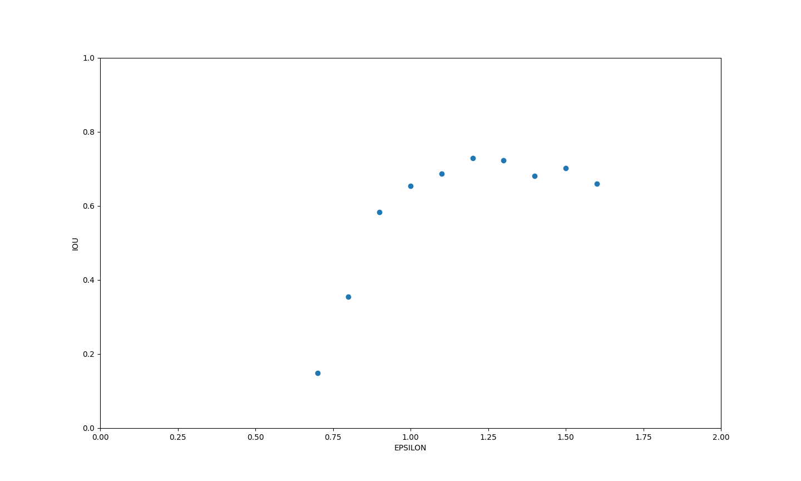

### UCY Data Set 

The dataset used in this project is open source and it is uploaded in [Repository](https://github.com/crowdbotp/OpenTraj/tree/master/datasets/UCY/zara01). The dataset has been transformed into csv files uploaded in the dataset folder by using annotations provided with the dataset.

### Visualization

The dataset can be visualized in the uploaded video named zara01_Visualization.mp4
The code for visualization can be found in data_visualization.py

### Code 

final_db_scan_complete.py in DB-Scan folder holds the complete and formalized code for this project. Rest of the folders and files are rough work and experiments.

### Groups.txt

This file holds the original/correct groups that exist. This is used to check the accuracy of the algorithm through IOU.

### Outputs

It contain files that are output of the print statements in the code. These are used for analysis and debugging.

### Algorithm steps:

1. Db scan ran on each dataframe/timestamp which returned the cluster per frame. 

2. Take Union of the clusters in all frames from above step and find the count of existence of each cluster.

3. Make a dictionary in python. Add groups in the dictionary like:

	Group, count of existence

		{0,1}, 1    
		{2,3}, 1    
		{4,5}, 1    

	ignore the outliers. run this step over all the timestamps to get accumulated value of the groups. so in the end we will have for eg:

		{0,1}, 24    
		{2,3}, 20    
		{4,5}, 10    
		…………..
		…………..

4. list all the data frames that each element in a cluster existed and take union of all to find uniue data frames in which atleast one of the element existed.
   

5. Now we we have to find out value of R for each group.
	
	R =  	each cluster value in step 3 / each cluster value in step 4

	Lets say for agent {0,1}:
		
		{O,1} occurs together in timestamp: 1,2,3,4,5,
		
		0 individually occurs in : 1,2,3,8,11,12,13,14,15,16
		1 individually occurs in : 1,2,3,8,11,12,13

    	R =  count (1,2,3,4,5,) /  count (Union of (1,2,3,8,11,12,13,14,15,16 and 1,2,3,8,11,12,13))
		R= 5/ 10 = 1/2 = 0.5

	Now set an arbitrary threshold value for R, let say 0.4. 

	So for each group you will repeat this step and keep only those groups for which the calculated R value is greater than 0.4, considering it as a group

5. Calculate IoU by dividing "the number of groups that are intersecting between predicted groups and real groups" by "the union of predicted groups and real groups"

### Graph

Plotting IoU against changing values of epsilon by keeping value of R as 0.5

